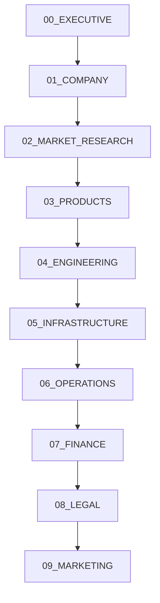

# 🏢 KRISHI KSHETRA: Infrastructure Planning & Investment Proposal

**Version**: `1.0.0-draft`  
**Date**: July 25, 2026  
**Status**: Proposal Phase  

---

## ℹ️ Project Overview
**Krishi Kshetra** is a modern agricultural technology startup focused on integrating advanced software, robotics, and hardware IoT solutions to optimize farming and post-harvest infrastructure. This repository contains the comprehensive blueprint, technical specs, financial projections, and legal frameworks governing the design and construction of the Krishi Kshetra Headquarters, R&D Labs, and testing environments.

---

## 🎯 Purpose of This Repository
This repository serves as the single source of truth (SSoT) for all internal stakeholders, engineering teams, and prospective investment partners. It details:
* The physical engineering requirements for robotics, mechanical, and ESD testing environments.
* The IT, NAS, backup, and cloud computing architectures supporting continuous integration and deployment.
* The financial modeling, operational budgets, and resource allocation timelines required to execute the startup roadmap.

---

## 🚀 Objectives
1. **Infrastructure Scalability**: Design a high-capacity workspace supporting multi-disciplinary engineering (AI, Robotics, IoT, and Cloud Services).
2. **Resource Optimization**: Leverage renewable energy configurations (Solar and Battery Backups) to lower overhead operational costs.
3. **Regulatory and Standards Compliance**: Build labs adhering to ISO standards, ESD safety protocols, and regional building codes.
4. **Transparent Financial Projections**: Provide investors with a clear, audit-ready breakdown of initial Capex and recurring Opex.

---

## 📁 Repository Structure
The documentation is modularized into 10 structured sections. Use the table below for quick navigation to individual specifications:

| Section | Description | Key Documents |
| :--- | :--- | :--- |
| **[00_EXECUTIVE](./00_EXECUTIVE/)** | Executive summaries, business overview, investment memorandums, and investor FAQs. | [Executive Summary](./00_EXECUTIVE/00.01_Executive_Summary.md) \| [Investment Memo](./00_EXECUTIVE/00.02_Investment_Memorandum.md) |
| **[01_COMPANY](./01_COMPANY/)** | Corporate identity, mission, vision, governance structure, and organizational planning. | [Vision](./01_COMPANY/01.01_Vision.md) \| [Mission](./01_COMPANY/01.02_Mission.md) |
| **[02_MARKET_RESEARCH](./02_MARKET_RESEARCH/)** | Market segments, TAM/SAM/SOM, buyer personas, competitor analysis, and GTM strategy. | [TAM](./02_MARKET_RESEARCH/02.04_TAM.md) \| [Go To Market](./02_MARKET_RESEARCH/02.14_Go_To_Market.md) |
| **[03_PRODUCTS](./03_PRODUCTS/)** | Product roadmap, pricing models, and specs for software, IoT, robotics, and mobile clients. | [Mobile App](./03_PRODUCTS/03.11_Mobile_App.md) \| [IoT Platform](./03_PRODUCTS/03.08_IoT_Platform.md) |
| **[04_ENGINEERING](./04_ENGINEERING/)** | Technical architectures, software systems, AI pipelines, robotics mechatronics, and DevOps. | [Software Arch](./04_ENGINEERING/04.01_Software_Architecture.md) \| [AI Arch](./04_ENGINEERING/04.02_AI_Architecture.md) |
| **[05_INFRASTRUCTURE](./05_INFRASTRUCTURE/)** | Headquarters, laboratory specs, energy systems, server infrastructure, and asset registers. | [Headquarters](./05_INFRASTRUCTURE/05.01_Headquarters.md) \| [Robotics Lab](./05_INFRASTRUCTURE/05.05_Robotics_Lab.md) |
| **[06_OPERATIONS](./06_OPERATIONS/)** | Hiring forecasts, reporting hierarchy, salary frameworks, SOPs, and business continuity. | [Hiring Plan](./06_OPERATIONS/06.01_Hiring_Plan.md) \| [SOPs](./06_OPERATIONS/06.06_SOPs.md) |
| **[07_FINANCE](./07_FINANCE/)** | Detailed CAPEX, OPEX, five-year forecasts, valuations, cashflow, and funding rounds. | [CAPEX](./07_FINANCE/07.01_CAPEX.md) \| [Five Year Forecast](./07_FINANCE/07.08_Five_Year_Forecast.md) |
| **[08_LEGAL](./08_LEGAL/)** | Patent strategy, IP registry, compliance audits, terms of service, and risk register. | [IP Strategy](./08_LEGAL/08.02_IP_Strategy.md) \| [Compliance](./08_LEGAL/08.05_Compliance.md) |
| **[09_MARKETING](./09_MARKETING/)** | Branding strategy, content pipelines, social media, PR, partnerships, and marketing KPIs. | [Brand Strategy](./09_MARKETING/09.01_Brand_Strategy.md) \| [Marketing Strategy](./09_MARKETING/09.02_Marketing_Strategy.md) |

---

## 🗺️ Document Roadmap
Our documentation follows a progressive dependency flow. New readers should review documents in the following order:

---

## 📊 Funding Overview
The total capital request is structured across three core execution phases. Below is a high-level summary of capital allocation:

| Phase | Core Focus | Projected Capex ($) | Projected Opex ($/mo) | Target Milestone |
| :--- | :--- | :--- | :--- | :--- |
| **Phase 1** | Office renovation, Networking setup, and Basic Software Labs | $45,000 | $5,000 | Baseline operations active |
| **Phase 2** | Robotics R&D Lab setup, ESD safeguards, 3D printing & CNC installation | $85,000 | $12,000 | Hardware prototyping ready |
| **Phase 3** | IoT Field Testing, Apple/Android QA Rig setup, Media Studio deployment | $60,000 | $18,000 | Production-ready QA pipelines |

---

## 🛠️ Infrastructure Overview
Our physical and digital infrastructure is designed to maintain high availability and reliability:
* **Power Supply**: Dual-grid power setup with a 15kW rooftop Solar array backed by a hybrid UPS/battery system for 100% server and lab uptime.
* **Local Networking**: 10GbE fiber backbone routing with segregated VLANs for R&D IoT testing, development workstations, and public guest access.
* **Storage (NAS)**: ZFS-based network-attached storage with real-time replication and nightly automated offsite cloud backups (AWS S3 Glacier).
* **Labs**: Specialized workspaces including an Electrostatic Discharge (ESD) safe workbench area, mechanical tools workspace, and 3D modeling stations.

---

## 📈 Development Status
- [x] Phase 1 Core Directory Structure Initialized
- [x] SSH and Git Codespace connectivity established
- [/] Section Templates Generation (Ongoing)
- [ ] Financial Modeling Audit
- [ ] Vendor Quote Verification
- [ ] Final Proposal Sign-off

---

## 🔮 Future Updates
The following updates are scheduled for the next documentation release:
* Complete engineering floor plans and electrical diagrams to be added to the `/docs/Floor-Plans/` directory.
* Uploading verified vendor hardware quotes to the `/docs/Vendor-Quotes/` folder.
* Publishing the standardized Bill of Materials (BOM) file in the `/docs/BOM/` folder.

---

## 📄 License
This repository and its documentation are proprietary to Krishi Kshetra. All rights reserved. Redistribution or utilization of these planning assets without express written consent from Krishi Kshetra is prohibited. For details, refer to the [LICENSE](./LICENSE) file.

---

## ✉️ Contact
For investment inquiries, vendor partnerships, or technical questions regarding this blueprint, please contact:
* **Department**: Corporate Infrastructure & Development
* **Email**: infrastructure@krishikshetra.in
* **GitHub Organization**: [Atharva259](https://github.com/Atharva259)